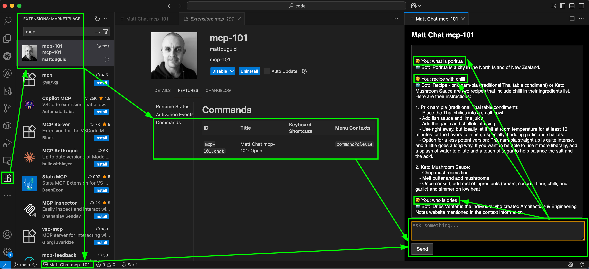

# mcp-101

## overview

- mcp-101 is a minimal proof-of-concept (POC) for running a local AI assistant that can answer questions from your own files. 
- it uses just the essentials: Python, Ollama, LlamaIndex, and a simple VS Code extension UI. 
- designed to test and validate the concept locally before iterating or scaling further.

## install python

- mac

```bash
brew install python
python3 --version
pip3 --version
```

- linux

```bash
sudo apt update
sudo apt install -y python3 python3-pip
python3 --version
pip3 --version
```

- windows

```bash
winget install Python.Python.3
python3 --version
pip3 --version
```

## install ollama

- mac
  - https://ollama.com/download/mac
- linux
  - https://ollama.com/download/linux
- windows
  - https://ollama.com/download/windows

## download ollama container(s)

```bash
# downloads on first run ~4.1GB
ollama run nomic-embed-text 
# OR
ollama run mistral
```

## create requirements.txt for python and install

[edit requirements.txt](requirements.txt) and add,

```text
llama-index
llama-index-llms-ollama
llama-index-embeddings-ollama
llama-index-readers-web
llama-index-readers-file
fastapi
uvicorn
```

```bash
pip3 install -r requirements.txt
```

## create folder of content to be searched

```bash
mkdir /data
# copy in any text files you want searched eg: *.pdf, *.md, *.txt, etc
```
- this uses a couple of .pdf/.md files containing recipes [/data](data)
- also a couple of web URLs, one for a wiki about the city of Porirua and one for a wiki of a work mate contained in the python code [/main.py#L32-L39](main.py#L32-L39)

## create MCP server from content to be searched

[edit main.py](main.py) which contains the code to run the MCP server including links to my sample .pdf/.md/web urls for custom content,

## run and test (from cli)

```bash
# run MCP server
python3 main.py

🔁 Loading documents...
🚀 Serving on http://localhost:8000/ask
INFO:     Will watch for changes in these directories: ['/<OMITTED>/mcp-101']
INFO:     Uvicorn running on http://127.0.0.1:8000 (Press CTRL+C to quit)
INFO:     Started reloader process [3360] using StatReload
🔁 Loading documents...
🔁 Loading documents...
INFO:     Started server process [3370]
INFO:     Waiting for application startup.
INFO:     Application startup complete.
```

```bash
# query MCP server
curl -X POST http://localhost:8000/ask -H "Content-Type: application/json" -d '{"query": "what is porirua"}'

{"answer":" Porirua is a city located in the North Island of New Zealand."}%
```

- now we know it works via the local API endpoint, it could be exposed to the outside world through method of choice such as cloudflared tunnels to wrap it with a custom domain name and SSL certificate
- in next step we can create a basic visual studio code extension to provide a UI for users to query it, initially locally just for this 101 exercise but if releasing for public consumption point it at the public API endpoint

## create visual studio plugin

### install node

- mac

```bash
# Download and install nvm
curl -o- https://raw.githubusercontent.com/nvm-sh/nvm/v0.40.3/install.sh | bash

# in lieu of restarting the shell
\. "$HOME/.nvm/nvm.sh"

# Download and install Node.js
nvm install 22

# Verify the Node.js version
node -v # Should print "v22.16.0".
nvm current # Should print "v22.16.0".

# Verify npm version
npm -v # Should print "10.9.2".

# install the visual studio code extension manager, allows creation of redistributable .vsix file
npm install -g vsce
```

- linux

```bash
# Download and install nvm
curl -o- https://raw.githubusercontent.com/nvm-sh/nvm/v0.40.3/install.sh | bash

# in lieu of restarting the shell
\. "$HOME/.nvm/nvm.sh"

# Download and install Node.js
nvm install 22

# Verify the Node.js version
node -v # Should print "v22.16.0".

nvm current # Should print "v22.16.0".

# Verify npm version
npm -v # Should print "10.9.2".

# install the visual studio code extension manager, allows creation of redistributable .vsix file
npm install -g vsce
```

- windows

```powershell
# Download and install Chocolatey
powershell -c "irm https://community.chocolatey.org/install.ps1|iex"

# Download and install Node.js
choco install nodejs-lts --version="22"

# Verify the Node.js version
node -v # Should print "v22.16.0".

# Verify npm version
npm -v # Should print "10.9.2".

# install the visual studio code extension manager, allows creation of redistributable .vsix file
npm install -g vsce
```

### create initial scaffold for a visual studio code extension

```bash/powershell
# create folder for vscode extension
cd <PATH_TO_REPO>
mkdir vscode-extensions-mcp-101
cd vscode-extensions-mcp-101

# create initial vscode extension scaffold
npm install -g yo generator-code
yo code

? What type of extension do you want to create? New Extension (TypeScript)
? What's the name of your extension? mcp-101
? What's the identifier of your extension? mcp-101
? What's the description of your extension? mcp-101
? Initialize a git repository? No
? Which bundler to use? webpack
? Which package manager to use? npm

Writing in /<OMITTED>/mcp-101...
   create mcp-101/.vscode/extensions.json
   create mcp-101/.vscode/launch.json
   create mcp-101/.vscode/settings.json
   create mcp-101/.vscode/tasks.json
   create mcp-101/package.json
   create mcp-101/tsconfig.json
   create mcp-101/.vscodeignore
   create mcp-101/webpack.config.js
   create mcp-101/vsc-extension-quickstart.md
   create mcp-101/README.md
   create mcp-101/CHANGELOG.md
   create mcp-101/src/extension.ts
   create mcp-101/src/test/extension.test.ts
   create mcp-101/.vscode-test.mjs
   create mcp-101/eslint.config.mjs

added 364 packages, and audited 365 packages in 9s

88 packages are looking for funding
  run `npm fund` for details

found 0 vulnerabilities

Your extension mcp-101 has been created!

To start editing with Visual Studio Code, use the following commands:

     code mcp-101

Open vsc-extension-quickstart.md inside the new extension for further instructions
on how to modify, test and publish your extension.

To run the extension you need to install the recommended extension 'amodio.tsl-problem-matcher'.

For more information, also visit http://code.visualstudio.com and follow us @code.
```

### add custom code to scaffold

[edit /vscode-extensions-mcp-101/src/extension.ts](/vscode-extensions-mcp-101/src/extension.ts) which contains the code for the vscode extension,

### edit package.json in scaffold

[edit /vscode-extensions-mcp-101/package.json](/vscode-extensions-mcp-101/package.json) which contains settings for the vscode extension,

specifically we,
- add "icon" which is our 128 pixel x 128 pixel in /icon.png used for the extension
- add "publisher" and "repository" which are required for packaging into a .vsix
- change "activationEvents" and "contributes/commands" for running the extension
- add "keybindings" for easy keyboard shortcuts

```json
...etc...

"icon": "icon.png",

...etc...

"publisher": "mattduguid", 
"repository": {
  "type": "git",
  "url": "https://github.com/mattduguid/mcp-101.git"
},

...etc...

"activationEvents": [],

..etc...

"contributes": {
    "commands": [
      {
        "command": "mcp-101.helloWorld",
        "title": "Hello World"
      }
    ]
  },

...etc...

"keybindings": [
  {
    "command": "mcp-101.chat",
    "key": "ctrl+alt+m",
    "mac": "ctrl+cmd+m",
    "when": "editorTextFocus || editorFocus || explorerViewletVisible || inCompositeEditor || sideBarVisible || panelVisible"
  }
],

...etc...
```

to,

```json
"activationEvents": [
  "onCommand:mcp-101.chat"
],

...etc...

"contributes": {
    "commands": [
      {
        "command": "mcp-101.chat",
        "title": "Matt Chat mcp-101: Open"
      }
    ]
  },
```

## build a redistributable .vsix for easy install/uninstall

create some files required for packaging into a .vsix,

```bash
cd /<OMITTED>/mcp-101/vscode-extensions-mcp-101
echo "# mcp-101" > README.md
echo "## Changelog" > CHANGELOG.md
echo "## License" > LICENSE.md
```

compile & package it,

```bash
cd /<OMITTED>/mcp-101/vscode-extensions-mcp-101
vsce package                  
Executing prepublish script 'npm run vscode:prepublish'...

> mcp-101@0.0.1 vscode:prepublish
> npm run package

> mcp-101@0.0.1 package
> webpack --mode production --devtool hidden-source-map

    [webpack-cli] Compiler starting... 
    [webpack-cli] Compiler is using config: '/<OMITTED>/mcp-101/vscode-extensions-mcp-101/webpack.config.js'
    [webpack-cli] Compiler finished
asset extension.js 3.42 KiB [compared for emit] [minimized] (name: main) 1 related asset
./src/extension.ts 4.2 KiB [built] [code generated]
external "vscode" 42 bytes [built] [code generated]
webpack 5.99.9 compiled successfully in 675 ms
 DONE  Packaged: /<OMITTED>/mcp-101/vscode-extensions-mcp-101/mcp-101-0.0.1.vsix (7 files, 4.03KB)
```

install it,

```bash
code --install-extension ./mcp-101-0.0.1.vsix

Installing extensions...
Extension 'mcp-101-0.0.1.vsix' was successfully installed.

code --list-extensions | grep "101"          
mattduguid.mcp-101
```

uninstall it,

```bash
code --uninstall-extension mattduguid.mcp-101

Uninstalling mattduguid.mcp-101...
Extension 'mattduguid.mcp-101' was successfully uninstalled!
```

use it, 

- via command palette
  - (Cmd+Shift+P) → type "Matt Chat mcp-101: Open"
- via keyboard shortcut
  - press Ctrl+Alt+M (Win/Linux) / Ctrl+Cmd+M (Mac) to launch the assistant.
- via the status bar button
  - bottom left of the visual studio code window click "Matt Chat mcp-101"


